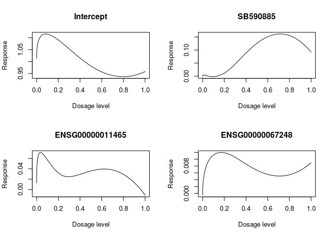

This is an example for the use of fbioSelectr package
================
Evanthia Koukouli
8 June 2020

``` r
# load the fbioSelectr package
library(fbioSelectr)

# load the data
load("test_gdsc_data.RData")

# Run the fbioSelect function
result = fbioSelect(y = fd$Response,
                    id = fd$ID,
                    t.var = fd$DosageSQ,
                    Z = model.matrix(~fd$DRUG_NAME),
                    X = fd[,-c(1:5)],
                    low.dim.cov.number=1,
                    threshold.size = floor(length(unique(fd$ID))/log(length(unique(fd$ID)))),
                    type.of.penalty = "grSCAD",
                    degree=3,
                    intercept=TRUE,
                    degrFreedom=5,
                    knots = NULL,
                    weights=fd$weights,
                    nfolds=10,
                    seed=1000,
                    ncores = 3)
 
# Plot some of the estimated coefficient functions
par(mfrow = c(2,2))
plot(seq(0,1,length = ncol(result$coefFunctions.pen.regression))^2, result$coefFunctions.pen.regression[1,], type = "l",
     xlab = "Dosage level", ylab = "Response", main = "Intercept")
plot(seq(0,1,length = ncol(result$coefFunctions.pen.regression))^2, result$coefFunctions.pen.regression[2,], type = "l",
     xlab = "Dosage level", ylab = "Response", main = "SB590885")
plot(seq(0,1,length = ncol(result$coefFunctions.pen.regression))^2, result$coefFunctions.pen.regression[3,], type = "l",
     xlab = "Dosage level", ylab = "Response", main = paste(result$active.hdcov.pen.regression[1]))
plot(seq(0,1,length = ncol(result$coefFunctions.pen.regression))^2, result$coefFunctions.pen.regression[4,], type = "l",
     xlab = "Dosage level", ylab = "Response", main = paste(result$active.hdcov.pen.regression[2]))
```



``` r
par(mfrow = c(1,1))
```
